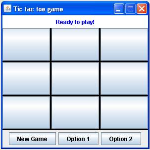

# Enunciado

Tic tac toe exercise

Tic tac toe goes on between two players; each one chooses a symbol to represent
his/her self during the game. The symbol is usually either an "O" or an "X".
Players take turns placing their symbol on a board with nine positions.
The player that manages to place three of his/her symbols in line, be it horizontally,
vertically or diagonally, wins. If all nine positions in the board have been occupied
and neither player managed to place three symbols in line, the match has reached a draw.

The goal of this exercise is to develop a program for tic tac toe where a human player
can play against the computer. In order to achieve this, a simple game strategy has
to be formulated. For example, one strategy for the computer player could be to place
its symbol on the first available position.

Also, the human player must have the possibility to restart the game and clear the board
at any given time.

# Graphical User Interface

The following picture shows the graphical user interface of the tic tac toe. The human
player have to click on empty squares.

